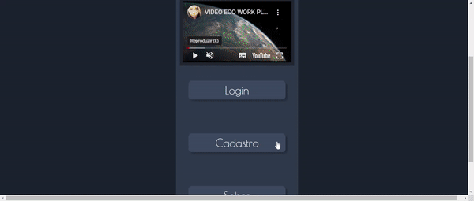
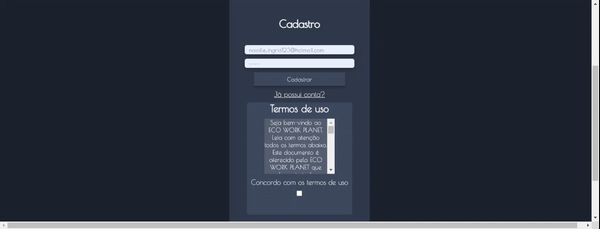
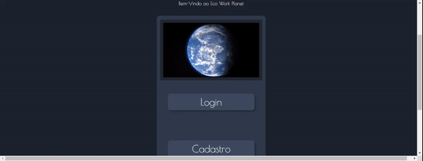
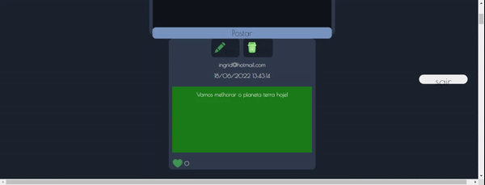
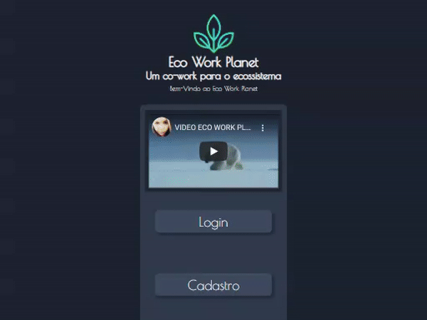
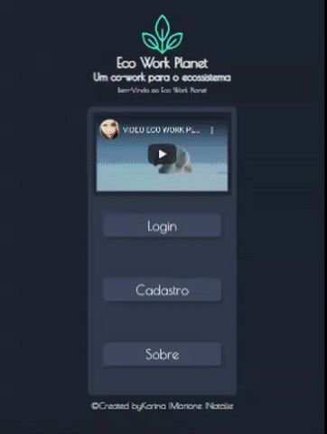
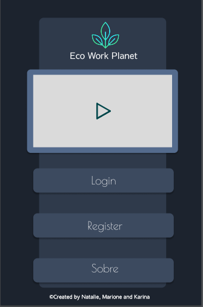
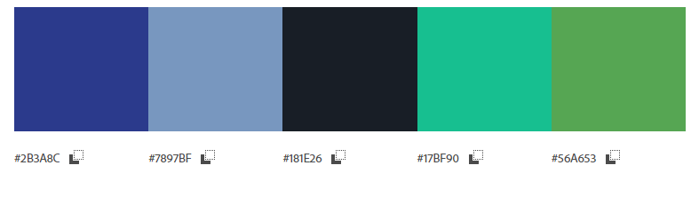

# Criando uma Rede Social

## Índice

- [1. Introdução](#1-Introdução)
- [2. Resumo do Projeto](#2-Resumo-do-projeto)
- [3. Futuro do Projeto](#3-Futuro-do-Projeto)
- [4. Demonstrações da Aplicação Web](#4-Demonstrações-da-Aplicação-Web)
- [5.Pesquisa de usuários](#5-Pesquisa-de-usuários)
- [6.Histórias de usuário](#6-histórias-de-usuário)
- [7. Objetivos de aprendizagem](#7-objetivos-de-aprendizagem)
- [8.Design](#8-Design)
- [9. Linguagens e ferramentas utilizadas ](#9-Linguagens-e-ferramentas-utilizadas)
- [10. Desenvolvedoras](#10-desenvolvedoras)

## 1. Introdução

<h2>Eco Work Planet</h2>

Terceiro projeto desenvolvido no bootcamp de front-end da Laboratoria, neste projeto nós tinhamos o objetivo de desenvolver uma rede social de tema livre utilizando a modalidade de [Single-page Application(SPA)](https://pt.wikipedia.org/wiki/Aplicativo_de_p%C3%A1gina_%C3%BAnica)[_responsiva_] que possuísse mais de uma tela ou página e que fosse possível ler e escrever dados.

---
## 2. Resumo do projeto

Diante de tantos acontecimentos em grande escala, como por exemplo: aquecimento global, queimadas, derretimento de geleiras, calor excessivo, frio excessivo e muitos outros fatores naturais, optamos por escolher este tema de grande relevância para os dias atuais. Assim como diversas pessoas e empresas nós também nos preocupamos com o meio ambiente, com a forma que estamos vivendo e sentimos que temos a obrigação de contribuir tanto para com a sociedade quanto para com o ecossistema. Nos conscientizamos em reduzir ou evitar os efeitos nocivos ocasionados pela atuação humana. A partir dessa reflexão surgiu a [Eco Work Planet](https://natalieiss.github.io/Terceiro-Projeto-Social-Network) com o objetivo principal de ser uma rede social para dar uma maior visibilidade a ONGs gerando uma rede de apoio mútuo entre pessoas interessadas em contribuir com a sociedade e meio ambiente. Também é um espaço para levantar o debate sobre assuntos voltados a uma vida sustentável, descarte consciente de lixo, proteção aos animais entre outros assuntos ligados ao tema. Você pode acessar a aplicação clicando <a href="https://natalieiss.github.io/Terceiro-Projeto-Social-Network/">aqui</a>.

Para assistir ao vídeo da Eco-Work Planet, clique na imagem abaixo:

Se preferir não se cadastrar nesta aplicação web, será possível realizar o _login_ na aplicação através dos _e-mails_ e senhas já cadastradas na aplicação:

Email: convidado@ecoworkplanet.com Senha: 123456

---

## 3. Futuro do Projeto

Para as próximas implementações (v2.0) iremos melhorar a segurança de nossos usuários acrescentando uma Política de Privacidade e Cookies dentre outras melhorias visando adequar nosso projeto ao disposto na Lei Geral de Proteção de Dados Pessoais (LGPD). 
Também pensamos em melhorar a acessibilidade da aplicação web para as pessoas com deficiência, como por exemplo, o acrescimo de uma opção de áudio descritivo que possibilitará aos usuários escutar a descrição dos comentários que escolherem dentre várias outras implementações que pensamos para aumentar a inclusão e acessibilidade em nossa aplicação web.
Realizaremos um refatoramento de todo o projeto e implementações na estilização.

---

## 4. Demonstrações da Aplicação Web

Versão Web

  
  
  
  

Versão Tablet

  
  

Versão Mobile

  

---

## 5. Pesquisa de usuários

## Foi realizada uma [pesquisa](https://docs.google.com/forms/d/13vHIxH0u_qzq2e3zOH9dK6DRGRPDYpaiPJdlIinBNKo/edit#responses) com 10 pessoas e esses foram os resultados:

Tem interesse em saber mais sobre como fazer o descarte adequado do lixo da sua casa?

Tem interesse em produtos naturais, veganos ou cruelty-free?

Tem interesse em melhorar a alimentação ou consumir produtos orgânicos?

Você utilizaria uma rede social sobre o meio ambiente?

Você acredita na forma de consumo consciente?

Acredita que sua comunidade tem um suporte para a valorização do meio ambiente em sua região?

Você sabe os pontos de reciclagem em sua cidade?

A informação de como podemos cuidar do nosso Meio-Ambiente chega fácil até você?

---

## 6.Histórias de usuário

Com base nas pesquisas chegamos nas seguintes histórias de usuários:

## 

---
## 7. Objetivos de aprendizagem

### HTML

- [ ] **Uso de HTML semântico**

### CSS

- [ ] **Uso de seletores de CSS**

- [ ] **Empregar o modelo de caixa (box model): borda, margem, preenchimento**

- [ ] **Uso de flexbox en CSS**

### Web APIs

- [ ] **Uso de seletores de DOM**

- [ ] **Gerenciamento de eventos de DOM**

- [ ] **Manipulação dinâmica de DOM**

- [ ] **Routing (History API, evento hashchange, window.location)**

### JavaScript

- [ ] **Manipular arrays (filter, map, sort, reduce)**

- [ ] **Manipular objects (key | value)**

- [ ] **Uso de condicionais (if-else, switch, operador ternário)**

- [ ] **Uso de laços (for, for..of, while)**

- [ ] **Uso de funções (parâmetros, argumentos, valor de retorno)**

- [ ] **Testes unitários**

- [ ] **Testes assíncronos**

- [ ] **Mocking**
- [ ] **Uso ES modules**

- [ ] **Uso de linter (ESLINT)**

- [ ] **Uso de identificadores descritivos (Nomenclatura | Semântica)**

- [ ] **Diferença entre expression e statements**

- [ ] **Uso de callbacks**

- [ ] **Promise**

### Git e GitHub

- [ ] **Git: Instalação e configuração**

- [ ] **Git: Controle de versão com git (init, clone, add, commit, status, push, pull, remote)**

- [ ] **Git: Integração de mudanças entre ramos (branch, checkout, fetch, merge, reset, rebase, tag)**

- [ ] **GitHub: Criação de contas e repositórios, configuração de chave SSH**

- [ ] **GitHub: Implantação com GitHub Pages**
- [ ] **GitHub: Colaboração pelo Github (branches | forks | pull requests | code review | tags)**

- [ ] **GitHub: Organização pelo Github (projects | issues | labels | milestones | releases)**

### user-centricity

- [ ] **Desenhar a aplicação pensando e entendendo a usuária**

### product-design

- [ ] **Criar protótipos para obter feedback e iterar**

- [ ] **Aplicar os princípios de desenho visual (contraste, alinhamento, hierarquia)**

### research

- [ ] **Planejar e executar testes de usabilidade**

### Firebase

- [ ] **Firebase Auth**

- [ ] **Firestore**

---

## 8. Design

## Desenho de interface do usuário

### Protótipo de baixa fidelidade

Abaixo o protótipo de alta fidelidade da página home versão mobile que foi desenhado na ferramenta
figma, que possibilitou a simulação do resultado da aplicação. Nossa intenção foi fazer uma interface simples, amigável e escolhemos cores que lembrasse o meio ambiente.

## 

Paleta de cores

## 

---

### 9. 💻Linguagens e ferramentas utilizadas

<article>

	

  
 
	

</article>

---

## 10. Desenvolvedoras

<table>
  <tr>
    <td align="center">
      <a href="https://github.com/KarinaMel0">
           
  
          <b>Karina Mel</b>
        
      </a>
    </td>
    <td align="center">
      <a href="https://github.com/Marione-Tainara">
   
             
          <b>Marione Pereira</b>
        
      </a>
    </td>
  </tr>
 <tr>
    <td align="center">
      <a href="https://github.com/natalieiss">
           
  
          <b>Natalie Silva</b>
        
      </a>
    </td>
</table>
