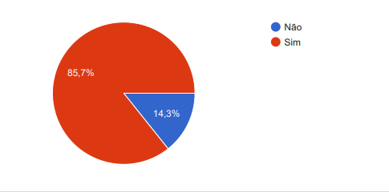
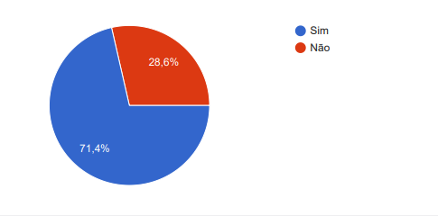
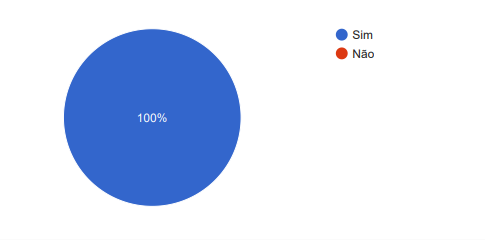
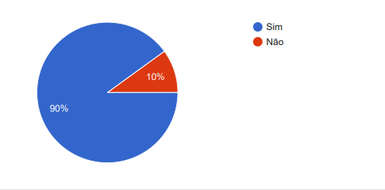
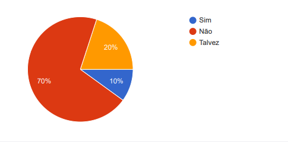
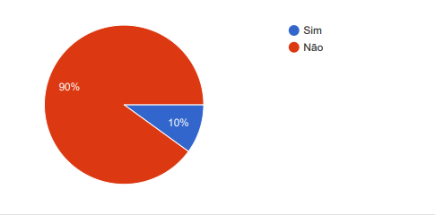
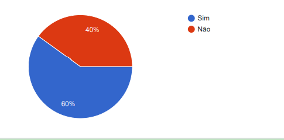
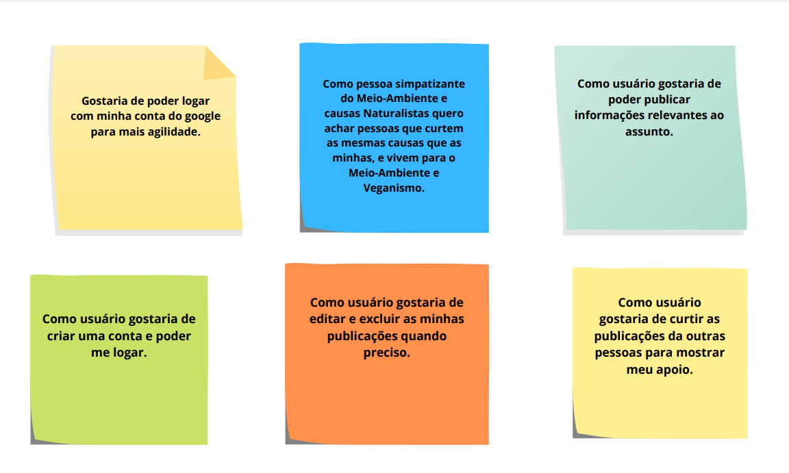

# Criando uma Rede Social

## Índice

- [1. Introdução](#1-introdução)
- [2. Resumo do projeto](#2-resumo-do-projeto)
- [3.Pesquisa de usuários](#3-pesquisa-de-usuários)
- [4.Histórias de usuário](#4.histórias-de-usuário)
- [5. Objetivos de aprendizagem](#5-objetivos-de-aprendizagem)
- [6.Design](#6-Design)
- [7. Linguagens e ferramentas utilizadas ](#7-Linguagens-e-ferramentas-utilizadas)
- [8. Desenvolvedoras](#8-desenvolvedoras)

## 1. Introdução

3° Projeto desenvolvido no bootcamp de front-end da Laboratoria, neste projeto nós tinha o objetivo de desenvolver uma rede social, e assim construímos uma [Single-page
Application
(SPA)](https://pt.wikipedia.org/wiki/Aplicativo_de_p%C3%A1gina_%C3%BAnica)
[_responsiva_] (com mais de uma tela/ página) na qual seja possível ler e escrever dados.

## 2. Resumo do projeto

---

Com tantos acontecimentos como, aquecimento global, queimadas, derretimento de geleiras, calor excessivo, frio excessivo e muitos outros fatores naturais, diversas as pessoas e empresas estão mais preocupadas com o meio ambiente e com a forma que estamos vivendo, para evitar e acabar com catástrofes naturais que são resultantes da ação dos próprios humanos. A partir disso surgiu a ideia de fazer a [Eco Work Planet](https://pt.wikipedia.org/wiki/Empanada), que tem como objetivo principal ser uma rede social para pessoas interessadas no assunto, levantar o debate sobre assuntos voltados a vida sustentável, como alimentação sustentável, descarte adequado do lixo, proteção aos animais, entre outros assuntos ligados ao tema.Você pode acessar a aplicação clicando <a href="https://github.com/natalieiss/SAP007-social-network">AQUI</a>

---

## 3. Pesquisa de usuários

## Foi realizada uma [pesquisa](https://docs.google.com/forms/d/13vHIxH0u_qzq2e3zOH9dK6DRGRPDYpaiPJdlIinBNKo/edit#responses) com 10 pessoas e esses foram os resultados:

Tem interesse em saber mais sobre como fazer o descarte adequado do lixo da sua casa?

Tem interesse em produtos naturais, veganos ou cruelty-free?

Tem interesse em melhorar a alimentação ou consumir produtos orgânicos?

Você utilizaria uma rede social sobre o meio ambiente?

Você acredita na forma de consumo consciente?

Acredita que sua comunidade tem um suporte para a valorização do meio ambiente em sua região?

Você sabe os pontos de reciclagem em sua cidade?

A informação de como podemos cuidar do nosso Meio-Ambiente chega fácil até você?

---

## 4.Histórias de usuário

Com base nas pesquisas chegamos nas seguintes histórias de usuários:

## 

## 3. Objetivos de aprendizagem

### HTML

- [ ] **Uso de HTML semântico**

### CSS

- [ ] **Uso de seletores de CSS**

- [ ] **Empregar o modelo de caixa (box model): borda, margem, preenchimento**

- [ ] **Uso de flexbox en CSS**

### Web APIs

- [ ] **Uso de seletores de DOM**

- [ ] **Gerenciamento de eventos de DOM**

- [ ] **Manipulação dinâmica de DOM**

- [ ] **Routing (History API, evento hashchange, window.location)**

### JavaScript

- [ ] **Manipular arrays (filter, map, sort, reduce)**

- [ ] **Manipular objects (key | value)**

- [ ] **Uso de condicionais (if-else, switch, operador ternário)**

- [ ] **Uso de laços (for, for..of, while)**

- [ ] **Uso de funções (parâmetros, argumentos, valor de retorno)**

- [ ] **Testes unitários**

- [ ] **Testes assíncronos**

- [ ] **Mocking**
- [ ] **Uso ES modules**

- [ ] **Uso de linter (ESLINT)**

- [ ] **Uso de identificadores descritivos (Nomenclatura | Semântica)**

- [ ] **Diferença entre expression e statements**

- [ ] **Uso de callbacks**

- [ ] **Promise**

### Git e GitHub

- [ ] **Git: Instalação e configuração**

- [ ] **Git: Controle de versão com git (init, clone, add, commit, status, push, pull, remote)**

- [ ] **Git: Integração de mudanças entre ramos (branch, checkout, fetch, merge, reset, rebase, tag)**

- [ ] **GitHub: Criação de contas e repositórios, configuração de chave SSH**

- [ ] **GitHub: Implantação com GitHub Pages**
- [ ] **GitHub: Colaboração pelo Github (branches | forks | pull requests | code review | tags)**

- [ ] **GitHub: Organização pelo Github (projects | issues | labels | milestones | releases)**

### user-centricity

- [ ] **Desenhar a aplicação pensando e entendendo a usuária**

### product-design

- [ ] **Criar protótipos para obter feedback e iterar**

- [ ] **Aplicar os princípios de desenho visual (contraste, alinhamento, hierarquia)**

### research

- [ ] **Planejar e executar testes de usabilidade**

### Firebase

- [ ] **Firebase Auth**

- [ ] **Firestore**

---

## 6. Design

## Desenho de interface do usuário

### Protótipo de baixa fidelidade

---

### 7. 💻Linguagens e ferramentas utilizadas

<article>

	

  
 
	

</article>

---

## 8. Desenvolvedoras

<table>
  <tr>
    <td align="center">
      <a href="https://github.com/KarinaMel0">
           
  
          <b>Karina Mel</b>
        
      </a>
    </td>
    <td align="center">
      <a href="https://github.com/Marione-Tainara">
   
             
          <b>Marione Pereira</b>
        
      </a>
    </td>
  </tr>
 <tr>
    <td align="center">
      <a href="https://github.com/natalieiss">
           
  
          <b>Natalie Silva</b>
        
      </a>
    </td>
</table>
